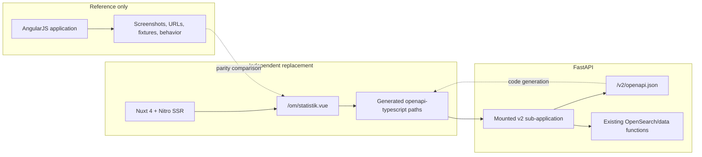

# Nuxt and Typed API v2 Statistics Foundation Design

**Date:** 2026-07-15

**Status:** Approved for implementation planning

## Objective

Establish the final-form foundation for replacing the AngularJS application with an independent Nuxt 4 hybrid/SSR application. Prove the architecture with a visually and behaviorally equivalent `/om/statistik` page backed by a clean, typed FastAPI v2 API and a generated TypeScript client.

The migration is architectural. It must not redesign Litteraturbanken.

## Context

The current frontend is an AngularJS 1.7.9 SPA built with Vite. It has 55 explicit route patterns, roughly 37 API URL shapes, large Angular controllers and templates, extensive global browser state, and handwritten ambient TypeScript interfaces. The statistics page is a useful first route because it is read-only, already has a pure ranking helper, and has Playwright coverage.

The FastAPI backend currently exposes 43 runtime operations. Only 28 appear in its OpenAPI document, only seven have domain response schemas, and several documented schemas do not match their runtime envelopes. Dynamic `include` and `exclude` query parameters also make legacy query responses sparse and difficult to describe accurately enough for generated clients.

The replacement will therefore use a clean v2 API rather than encoding legacy query shapes into the new Nuxt client.

## Decisions

1. The target is Nuxt 4 with Nitro hybrid/SSR rendering.
2. Nuxt is an independent replacement application, not an AngularJS/Vue strangler deployment.
3. The AngularJS application remains untouched and serves only as a visual, behavioral, URL, and fixture reference.
4. No intermediate mixed-framework site is expected to be deployed.
5. Production deployment, routing, and rollback are separate later work.
6. The first slice is `/om/statistik` plus the durable API/code-generation foundation it needs.
7. The new frontend uses a dedicated typed FastAPI v2 contract.
8. The current appearance, wording, routes, responsive behavior, and interactions are acceptance baselines.
9. Page-specific data loading and model assembly stay in the page's `<script setup>` rather than a one-use composable, store, or repository.
10. Tailwind UI patterns and Headless UI primitives are introduced only at a real interactive consumer and must retain the current visual design.

## Scope

### Included

- A standalone Nuxt 4 application under `nuxt/`.
- A visually equivalent global shell sufficient for `/om/statistik`.
- The complete statistics page, including its about-section navigation.
- A dedicated FastAPI v2 sub-application.
- Typed statistics, popular-works, popular-EPUB, and error responses.
- A deterministic v2 OpenAPI schema.
- Generated TypeScript API paths and a small shared client configuration.
- Local SSR and browser API configuration.
- Backend contract tests, frontend behavior tests, SSR assertions, and visual parity tests.

### Excluded

- Production deployment or changes to Nomad, Caddy, `lb-infra`, or `lb-meta`.
- A local route gateway or framework handoff.
- Shared AngularJS/Vue runtime or compatibility modules.
- Changes to AngularJS application code.
- Functional Nuxt implementations of routes other than `/om/statistik`.
- A visual redesign or information-architecture change.
- A Tailwind major-version upgrade.
- Generic dropdown, dialog, store, composable, repository, or component abstractions without a current consumer.
- Removal of the legacy API or AngularJS application.

## Architecture

AngularJS and Nuxt run independently during development. Nuxt calls only the v2 API. AngularJS is not part of the Nuxt runtime and is not proxied through Nuxt.



The eventual production cutover replaces AngularJS with Nuxt as one later sub-project. No first-slice code should assume or implement that deployment topology.

## Frontend Structure

The Nuxt application is isolated under `nuxt/` with its own package manifest and lockfile. It does not import source files, styles, globals, or runtime dependencies from the AngularJS application.

Initial responsibilities are:

- `nuxt/nuxt.config.ts`: SSR, runtime API bases, local API proxy, global CSS, and route configuration.
- `nuxt/app/app.vue`: Nuxt layout/page entry point.
- `nuxt/app/layouts/default.vue`: the existing global site chrome, reproduced with Nuxt-owned assets and styles.
- `nuxt/app/pages/om/statistik.vue`: about navigation, metadata, all statistics data loading/model assembly, and the complete page template.
- `nuxt/app/lib/api/client.ts`: generated-client construction and server/browser base URL selection.
- `nuxt/app/lib/api/generated/lbapi.ts`: generated output; never edited manually.
- `nuxt/app/assets/` and `nuxt/public/`: Nuxt-owned copies of the styles, fonts, images, and static assets needed for parity.
- `nuxt/test/`: Nuxt-specific unit, SSR, and Playwright coverage.

The statistics page uses top-level `await useAsyncData(...)` inside `<script setup lang="ts">`. It calls the generated client directly, performs its small page-specific URL and display mappings in the same file, and renders the existing content in the same single-file component.

There is no statistics composable, store, repository, adapter, or presentational component split. Reusable abstractions are extracted later only after a second Nuxt consumer exists.

The Nuxt application initially retains the current Tailwind 3.4 configuration and visual behavior. Tailwind UI is a markup/pattern source, not permission to restyle the site. `@headlessui/vue` is added when the first migrated interaction genuinely needs a menu, listbox, disclosure, popover, or dialog. Such primitives must be styled to match the current UI.

## FastAPI v2 Boundary

The existing FastAPI application mounts a dedicated sub-application at `/v2`. The v2 sub-application owns its routes, models, exception handlers, metadata, stable operation IDs, and OpenAPI document. Legacy routes stay outside the v2 schema.

The initial backend structure is intentionally small:

- `lbapi/v2/app.py`: creates the v2 FastAPI app, installs error handlers, and includes the first router.
- `lbapi/v2/models.py`: first-slice response and error models.
- `lbapi/v2/stats.py`: the three endpoints and mapping from existing data functions into v2 DTOs.
- `lbapi/web.py`: mounts the v2 application; no legacy route rewrite.
- `scripts/export_v2_openapi.py`: writes deterministic v2 OpenAPI JSON.
- `openapi/v2.json`: committed contract snapshot.

Future domains add focused modules under `lbapi/v2/` instead of growing `stats.py` or the existing `lbapi/web.py` monolith.

### Response Models

All numeric counts are non-negative integers. The first-slice DTOs are:

- `MediaCounts`: `etext: int`, `faksimil: int`.
- `StatsResponse`: `works: int`, `authors: int`, `pages: MediaCounts`, `words: MediaCounts`, `epubs: int`.
- `AuthorSummary`: `author_id: str`, `full_name: str`, `surname: str | None`.
- `WorkRepresentation`: `work_id: str`, `media_type: "etext" | "faksimil" | "pdf"`, `start_page_name: str | None`.
- `PopularWork`: `title_id: str`, `title_path: str`, `title: str`, `short_title: str | None`, `author: AuthorSummary`, `representation: WorkRepresentation`.
- `PopularWorksResponse`: `items: list[PopularWork]`.
- `PopularEpub`: `title_id: str`, `title: str`, `short_title: str | None`, `author: AuthorSummary`.
- `PopularEpubsResponse`: `items: list[PopularEpub]`.
- `ErrorDetail`: `field: str | None`, `message: str`.
- `ApiError`: `code: str`, `message: str`, `details: list[ErrorDetail] | None`.
- `ApiErrorResponse`: `error: ApiError`.

`title_id` is the normalized existing `work_titleid` value with `titleid` as its fallback. Fields not listed above do not cross the v2 boundary in this slice.

### Endpoints

#### `GET /v2/stats`

Returns `StatsResponse`:

- `works: int`
- `authors: int`
- `pages.etext: int`
- `pages.faksimil: int`
- `words.etext: int`
- `words.faksimil: int`
- `epubs: int`

#### `GET /v2/works/popular?limit=30`

Returns `PopularWorksResponse` with `items: list[PopularWork]`.

Each item contains the stable title and author identifiers/display fields plus one explicitly selected `WorkRepresentation`. The representation contains the work ID, media type, and start-page identifier needed for Nuxt to build the existing reader URL. The backend owns OpenSearch querying, record grouping, and representation preference; sparse Elasticsearch documents and query DSL never leave the API boundary.

`limit` defaults to 30 and is bounded from 1 through 100.

#### `GET /v2/epubs/popular?limit=30`

Returns `PopularEpubsResponse` with `items: list[PopularEpub]`.

Each item contains the typed author/title identifiers and display fields needed to reproduce the current download and author links. The backend owns the EPUB availability filter and popularity ordering.

`limit` defaults to 30 and is bounded from 1 through 100.

### Error Contract

Every v2 error uses `ApiErrorResponse`:

```json
{
  "error": {
    "code": "stats_unavailable",
    "message": "Unable to load statistics",
    "details": null
  }
}
```

The v2 sub-application converts request validation, missing resources, OpenSearch failures, and unexpected failures into this documented envelope. Each operation declares its relevant non-2xx responses in OpenAPI.

## OpenAPI and TypeScript Generation

The v2 sub-application exposes only final-form v2 paths through `/v2/openapi.json`. `scripts/export_v2_openapi.py` serializes the same schema deterministically to `openapi/v2.json`, which is committed for review and drift checks.

The Nuxt package uses `openapi-typescript` to generate `nuxt/app/lib/api/generated/lbapi.ts` and `openapi-fetch` for typed requests. The generator accepts either a schema URL or file path. Its local default is the running backend at `http://127.0.0.1:8000/v2/openapi.json`.

Generated code is committed so Nuxt installs, type-checks, and tests without a running backend. A verification command regenerates it and fails when the working tree changes.

## Local Data Flow

Nuxt has two API bases:

- Server-side SSR: private runtime base `http://127.0.0.1:8000/v2` by default.
- Browser navigation: same-origin public base `/api/v2`.

During local development, Nuxt proxies `/api/v2/*` to the local FastAPI `/v2/*` routes. This proxy serves only API requests; it is not an AngularJS/Nuxt route gateway.

`statistik.vue` requests the three v2 resources independently inside `useAsyncData`. It preserves current visible failure behavior:

- If the summary fails, the statistics content remains hidden.
- If either ranking fails, that list remains empty while the rest renders.
- Development diagnostics are logged.
- No new loading, warning, or error UI is introduced in this architectural slice.
- An API failure does not turn the page into a Nuxt error page.

The page constructs the existing reader, author, and EPUB paths from typed identifiers. Destination routes may remain unimplemented in Nuxt until their own migration slices; the URLs must nevertheless match production.

## Visual and Behavioral Parity

The Nuxt page must retain:

- Current global shell and about-page navigation.
- Typography, colors, spacing, backgrounds, responsive behavior, and route/body styling.
- Swedish copy and number formatting.
- Metadata title and description.
- Heading and list structure.
- Thirty popular works and thirty popular EPUBs in the same order.
- Author, reader, and download URL formats.

Existing CSS and assets are copied into Nuxt ownership rather than imported from AngularJS. The two applications may temporarily contain duplicate assets, but there is no runtime or build dependency between them. Nuxt becomes the sole owner after final cutover.

## Verification

### Backend

- Model tests cover valid and invalid DTO construction.
- Endpoint tests cover the three success responses, limit bounds, data mapping, grouping, and ordering.
- Error tests cover each documented error envelope and status.
- The live `v2_app.openapi()` output must equal committed `openapi/v2.json`.
- Legacy endpoint tests continue to pass because the first slice does not rewrite them.

### Nuxt

- Type-checking succeeds under strict TypeScript.
- Regenerating `lbapi.ts` produces no diff.
- An SSR test verifies that direct `/om/statistik` HTML contains the metadata, headings, and fetched statistics before hydration.
- Playwright verifies number formatting, list lengths and order, link targets, download targets, and page metadata.
- Desktop and mobile screenshots are compared against approved AngularJS baselines. Baselines are not regenerated merely to make failures pass; visual differences require review.
- The browser has no hydration warnings, uncaught errors, or console errors.
- A dependency-boundary check verifies that Nuxt imports no AngularJS source or runtime package.

## Completion Criteria

The first slice is complete when:

1. The three typed v2 resources and documented error contract pass backend tests.
2. The committed v2 OpenAPI snapshot matches the running app.
3. The generated Nuxt client is reproducible.
4. Nuxt independently SSR-renders `/om/statistik` with the approved visual and behavioral parity.
5. All Nuxt type, SSR, behavior, and screenshot checks pass.
6. AngularJS remains unchanged.
7. No production infrastructure or mixed-framework compatibility layer has been added.

## Later Migration Sub-Projects

Each later domain receives its own design, plan, v2 contracts, and parity gate:

1. Remaining low-risk content pages: about, help, presentations, history, ID, and contact.
2. Global interactions such as quick search, menus, and dialogs, using Headless UI with current styling.
3. Catalog v2 resources and library/EPUB routes.
4. Author pages and Dramawebben.
5. Full-text search and URL-state behavior.
6. Reader/editor, SSE search, XML/HTML processing, dictionary lookup, and reading history.
7. Full parity audit, production architecture, one-time cutover, rollback, and AngularJS removal.

No intermediate mixed-framework deployment is part of this sequence.
