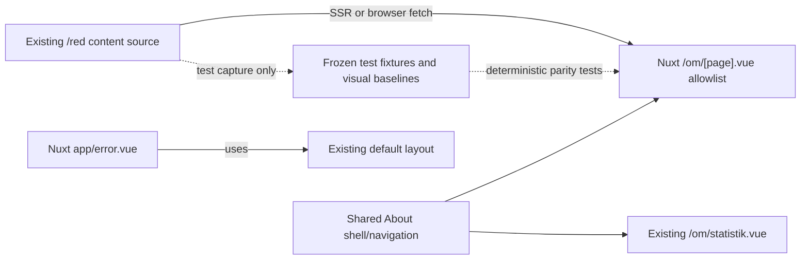

# Nuxt Static About Pages Design

**Date:** 2026-07-16

**Status:** Approved for implementation planning

## Objective

Extend the independent Nuxt application with the lowest-complexity public content routes while preserving the deployed AngularJS application exactly as the visual and behavioral authority.

The slice adds Nuxt-owned versions of:

- `/om/ide`
- `/om/organisation`
- `/om/rattigheter`
- `/om/tack`
- `/statistik` as the legacy alias for the existing `/om/statistik`
- the ordinary Swedish 404 page inside the existing site shell

This is an architectural migration only. It must not redesign, rewrite, modernize, or editorially correct the pages.

## Context

The existing AngularJS `/om/:page` route renders a shared About heading and navigation, then includes an HTML fragment selected by the route. Four linked pages have no client-side data model or interaction beyond ordinary links:

- Intro loads `/red/om/ide/omlitteraturbanken.html`.
- Organisation loads `/red/om/ide/organisation.html`.
- Rättigheter loads `/red/om/rattigheter/rattigheter.html`.
- Tack loads `/red/om/tack.html`.

The Nuxt application already reproduces the About shell for `/om/statistik`, but its navigation markup is page-local. The second consumer now justifies a shared About shell component.

The source fragments are deliberately not stored in this repository. They are managed and published through the existing `/red` content source. Nuxt must continue fetching them so editorial updates appear without a frontend build or content copy.

## Decisions

1. The four static About pages are the complete content scope of this slice.
2. The existing `/red` content source continues to own the HTML fragments and their embedded assets.
3. Nuxt fetches the fragments at runtime. Nitro SSR uses a private configured content origin; browser navigation uses the same-origin `/red` namespace.
4. Linked documents, external sites, and routes retain their current `href` values. This slice does not migrate their destinations.
5. A shared About shell/navigation component is extracted because both the existing statistics page and the new static route consume it.
6. Page content selection and metadata remain in the page's `<script setup>`; there is no content composable, repository, store, service, or CMS abstraction.
7. The four content routes may share one allowlisted dynamic Nuxt page. The route parameter selects a fixed content URL from that allowlist and is never interpolated into a remote URL. Unknown `/om/:page` values must return a real 404.
8. `/statistik` becomes a server redirect to `/om/statistik`, preserving its query string.
9. Nuxt gets an application error page that returns HTTP 404 and reproduces the legacy Swedish copy inside the existing shell.
10. The Organisation navigation quirk is preserved: no About tab is marked active on `/om/organisation`, because that is the current rendered behavior.
11. Tailwind UI and Headless UI are not used in this slice because it contains no menu, disclosure, dropdown, modal, or other interactive primitive.
12. AngularJS source remains unchanged and is used only for authority capture and comparison.

## Scope

### Included

- Four Nuxt SSR content routes under `/om/`.
- SSR and browser retrieval of the four current HTML fragments from their existing `/red` locations.
- Same-origin delivery of images and documents referenced by those fragments.
- Shared About heading and navigation markup used by the four routes and `/om/statistik`.
- Route-specific title, description, body classes, and About background.
- `/statistik` redirect behavior.
- Legacy-equivalent Nuxt 404 shell, status, title, and Swedish copy.
- Unit, SSR, browser behavior, and desktop/mobile visual-parity coverage.

### Excluded

- `/om/hjalp`, which has a generated anchor menu, URL state, toolkit placement, and scrolling behavior.
- `/om/kontakt`, which has two forms, validation, timed success/error states, query variants, and a write API.
- Translated and hidden About routes, including `/om/english.html`, `/om/deutsch.html`, `/om/francais.html`, and `/om/mål`.
- Home, presentations, history, ID lookup, author pages, Dramawebben, search, EPUB, library, reader, and editor routes.
- New FastAPI endpoints or changes to the generated API client.
- Migration of linked PDFs, external websites, or destination routes referenced by the content.
- Global quick search, dictionary lookup, notifications, or other shell interactions.
- Production routing, deployment, and cutover.
- Editorial corrections, including broken or obsolete links in the authority content.

## Approaches Considered

### A. Runtime-backed static About cluster — selected

Continue fetching the four fragments from their existing content source, render them through one allowlisted SSR page, and extract the now-genuinely-shared About shell. Add the only legacy alias whose target is already Nuxt-owned and add the shell-preserving 404.

This has the highest user-visible coverage per unit of risk, adds no backend contract, removes runtime Angular while preserving the existing editorial publishing path, and supports deterministic parity fixtures.

### B. Catalog utility pages

Migrate `/author_list`, `/id`, and `/url_list` with new typed v2 contracts. These pages are bounded, but they require backend pagination, lookup/grouping semantics, generated-client changes, and table behavior. They are useful later but are not as low-risk as static content.

### C. Broader content spread

Combine About pages with Help, home, and presentations. Those routes appear content-oriented but introduce anchor state, content ownership validation, unique backgrounds, cache-busting, and arbitrary document loading. Combining them would weaken the parity and review boundary.

## Architecture



Nuxt continues to fetch these fragments from `/red` at runtime. This is content retrieval, not an Angular compatibility layer: no Angular code, template compiler, bootstrap, route handoff, or mixed-framework runtime is involved. The frontend renders the returned first-party HTML directly in the existing DOM structure.

## Frontend Structure

The planned responsibilities are:

- `nuxt/app/components/about/AboutPageShell.vue`: renders the shared `h1`, exact About navigation, and a content slot. It accepts the active route identifier, including an explicit `null` value for Organisation's no-active-tab authority behavior.
- `nuxt/app/pages/om/[page].vue`: owns the content URL allowlist, generated-client-independent fetch, route validation, SEO metadata, body/background classes, and fragment rendering.
- `nuxt/app/pages/om/statistik.vue`: retains all page-specific API calls and mappings, but renders its existing content through `AboutPageShell`.
- `nuxt/app/error.vue`: renders legacy 404 content through the existing default layout and sets only generic `focus ready` body state.
- `nuxt/nuxt.config.ts`: adds private/public content bases, the local `/red` development proxy, the `/statistik` redirect, and explicit SSR behavior for the About routes.
- `nuxt/test/fixtures/about-content/`: test-only snapshots of the four responses used to make SSR, behavior, and visual comparisons deterministic.

The private content base defaults to `https://red.litteraturbanken.se` and may be overridden with `NUXT_CONTENT_BASE`. The public content base defaults to the empty same-origin prefix and may be overridden with `NUXT_PUBLIC_CONTENT_BASE`. The allowlisted paths already begin with `/red`, so the browser requests the same URLs as Angular.

The dynamic page uses an explicit typed record such as:

```ts
const pages = {
  ide: { title: "Om LB", active: "ide", contentPath: "/red/om/ide/omlitteraturbanken.html" },
  organisation: { title: "Om LB", active: null, contentPath: "/red/om/ide/organisation.html" },
  rattigheter: { title: "Om LB", active: "rattigheter", contentPath: "/red/om/rattigheter/rattigheter.html" },
  tack: { title: "Om LB", active: "tack", contentPath: "/red/om/tack.html" }
} as const
```

The route parameter is treated as an opaque string and looked up in this record. A missing entry raises `createError({ statusCode: 404 })`. It is never interpolated into an import, filesystem path, or request URL.

## Content Ownership and Safety

The HTML is trusted first-party editorial content already rendered by the authority application. Nuxt fetches it only from the configured content origin and a fixed allowlisted path, then renders it with `v-html`. Nuxt does not accept a content URL or HTML from a route parameter, user input, API query parameter, or browser storage.

The runtime preserves the existing publishing and embedded-asset behavior:

1. Nitro requests the configured private content base plus the allowlisted `/red/...` path during SSR.
2. Client-side route navigation requests the same allowlisted path through the public same-origin `/red` base.
3. Relative root paths inside the returned HTML, including images and documents, continue resolving through `/red` without rewriting.
4. The local Nuxt development server proxies only the `/red` namespace to the configured content host.
5. No response is written into the frontend source tree or bundled into the production build.
6. A frontend deployment therefore never becomes the publication mechanism for these pages.

Test fixtures are captured copies used only for deterministic automated checks. They do not supply runtime content and do not change content ownership. No generic content composable, repository, sanitizer, or HTML-fetch abstraction is introduced in this slice.

## Rendering and Data Flow

Direct requests to all four routes use Nitro SSR. Rendering has no FastAPI or generated-client dependency:

1. Nuxt resolves `[page]`.
2. `<script setup>` validates it against the local allowlist.
3. The page chooses the fixed content path and route metadata.
4. Page-owned `useAsyncData`, keyed by the selected page, fetches the fragment from the server or browser content base.
5. `AboutPageShell` renders the existing heading/navigation.
6. The page inserts the trusted fragment in the same wrapper shape as Angular's default include.
7. SSR serializes the result so hydration does not refetch; later client route navigation fetches the newly selected fragment.

Internal and external links behave as ordinary anchors, matching Angular. Destination routes can remain unimplemented until their own migration slices.

If the content request fails, Nuxt retains the About heading and navigation and leaves the fragment area empty, matching the legacy include's visible behavior. Development diagnostics may be logged, but this slice adds no new user-facing error design.

## Redirect and Error Behavior

`/statistik` returns a server redirect to `/om/statistik`. The redirect is permanent and preserves the query string. Browser fragments are retained by browser navigation.

The Nuxt error page handles ordinary missing frontend routes separately from route compatibility logic. For a 404 it must:

- return HTTP 404;
- set the title to `Sidan kan inte hittas | Litteraturbanken`;
- render the existing left and right corridors and navigation;
- render the exact two Swedish legacy paragraphs;
- set `body` to generic `focus ready` state without `page-about`;
- avoid retaining the About background after client navigation from an About page.

It must not become a catch-all redirector for ASCII author URLs or other deferred Angular behavior. Non-404 errors may use a concise generic Swedish error message but remain inside the same shell.

## Visual and Behavioral Parity

The deployed Angular application is the authority for:

- shell geometry, typography, spacing, and responsive behavior;
- About heading and navigation markup;
- the Organisation no-active-tab quirk;
- live fragment content, IDs, link targets, images, and wrapping at the authority-capture time;
- body classes and About background;
- 404 copy, title, shell, and absence of a stale page background.

The shared-shell extraction must produce no screenshot change on `/om/statistik`. The new component exists for code ownership, not to alter markup or CSS.

Desktop capture uses the existing 1440×1000 authority viewport. Mobile capture uses the existing iPhone 13 Chromium project. Each new content route receives an approved desktop and mobile baseline captured with the same response body stored as its test fixture. Runtime pages still fetch live content.

## Testing

### Unit and boundary tests

- The content allowlist contains exactly the four approved route keys and exact `/red` paths.
- Each test fixture contains representative beginning, middle, and ending landmarks so accidental truncation fails clearly.
- Requests cannot escape the configured content base or use a route-derived remote path.
- Nuxt imports no AngularJS source, runtime dependency, iframe, or mixed-framework handoff.
- The statistics page uses the shared About shell without moving its page-owned API logic.

### SSR tests

- Each route fetches its exact content path and returns 200 with heading, navigation, metadata, and representative fragment content before hydration.
- Content-origin failure returns the About shell without fragment content and does not expose upstream details.
- Unknown `/om/:page` returns 404 and never exposes a file or import error.
- `/statistik?source=legacy` redirects to `/om/statistik?source=legacy`.
- A missing route returns HTTP 404, the exact Swedish copy, the legacy title, and shell selectors.

### Browser behavior tests

- All About navigation links retain their exact targets and active state.
- Organisation has no active navigation item.
- Rights images continue loading through their existing `/red` paths and license links retain exact targets.
- Representative Intro and Tack links retain exact targets.
- Navigation from `/om/statistik` to each static page and back hydrates without warnings or refetches.
- Navigation from an About page to a missing URL clears `page-about` and the About background.
- `/statistik` preserves query and fragment behavior through the redirect.

### Visual tests

- Desktop and mobile screenshots for all four routes match their approved Angular authority baselines.
- `/om/statistik` retains its existing desktop and mobile parity baselines after shell extraction.
- The 404 receives structural/browser assertions; a visual baseline is added only if the authority background can be captured deterministically.

## Completion Criteria

The slice is complete when:

1. The four About routes independently SSR-render content fetched from their existing allowlisted `/red` locations.
2. Editorial updates remain controlled by the existing content source and require no Nuxt build.
3. `/om/statistik` uses the shared shell with no visual or behavioral change.
4. `/statistik` redirects correctly and preserves its query string.
5. Missing routes return a shell-preserving HTTP 404 with exact legacy copy.
6. Unit, SSR, browser, type-check, build, and desktop/mobile parity checks pass.
7. AngularJS source remains unchanged.
8. No library, reader, backend-contract, deployment, production content copy, or Angular compatibility-layer work enters the batch.

## Follow-On Slices

The next low-to-medium routes remain independently reviewable:

1. Help, including anchor discovery, `?ankare=` state, toolkit placement, and scrolling.
2. Contact, beginning with a typed v2 write contract and then form behavior.
3. Translated/hidden About pages.
4. Catalog utilities such as author list, ID lookup, and URL list with focused v2 contracts.
5. Home and presentations after their content-ownership rules are designed.

Library and reader remain explicitly deferred because they are large stateful domains, not low-hanging routes.
