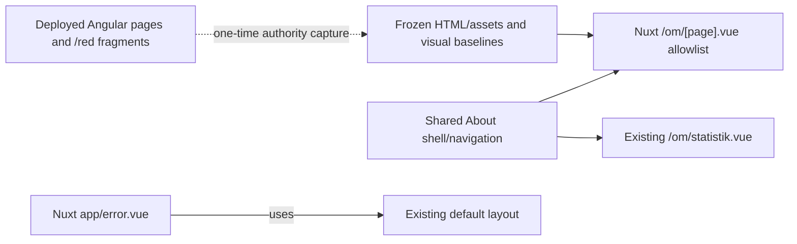

# Nuxt Static About Pages Design

**Date:** 2026-07-16

**Status:** Approved for implementation planning

## Objective

Extend the independent Nuxt application with the lowest-complexity public content routes while preserving the deployed AngularJS application exactly as the visual and behavioral authority.

The slice adds Nuxt-owned versions of:

- `/om/ide`
- `/om/organisation`
- `/om/rattigheter`
- `/om/tack`
- `/statistik` as the legacy alias for the existing `/om/statistik`
- the ordinary Swedish 404 page inside the existing site shell

This is an architectural migration only. It must not redesign, rewrite, modernize, or editorially correct the pages.

## Context

The existing AngularJS `/om/:page` route renders a shared About heading and navigation, then includes an HTML fragment selected by the route. Four linked pages have no client-side data model or interaction beyond ordinary links:

- Intro loads `/red/om/ide/omlitteraturbanken.html`.
- Organisation loads `/red/om/ide/organisation.html`.
- Rättigheter loads `/red/om/rattigheter/rattigheter.html`.
- Tack loads `/red/om/tack.html`.

The Nuxt application already reproduces the About shell for `/om/statistik`, but its navigation markup is page-local. The second consumer now justifies a shared About shell component.

The source fragments are not stored in this repository. Leaving them as runtime `/red` includes would preserve a deployment dependency that is unnecessary for static pages. This slice snapshots the currently deployed HTML into Nuxt ownership at the same point that the Angular visual baselines are captured.

## Decisions

1. The four static About pages are the complete content scope of this slice.
2. Nuxt owns frozen copies of their rendered HTML content and the inline images required to render them.
3. The fragments are captured byte-for-byte from the current `/red` authority, apart from mechanical adjustments required for Nuxt-owned static asset paths.
4. Linked documents, external sites, and routes retain their current `href` values. This slice does not migrate their destinations.
5. A shared About shell/navigation component is extracted because both the existing statistics page and the new static route consume it.
6. Page content selection and metadata remain in the page's `<script setup>`; there is no content composable, repository, store, service, or CMS abstraction.
7. The four content routes may share one allowlisted dynamic Nuxt page. Unknown `/om/:page` values must return a real 404 rather than expose arbitrary file loading.
8. `/statistik` becomes a server redirect to `/om/statistik`, preserving its query string.
9. Nuxt gets an application error page that returns HTTP 404 and reproduces the legacy Swedish copy inside the existing shell.
10. The Organisation navigation quirk is preserved: no About tab is marked active on `/om/organisation`, because that is the current rendered behavior.
11. Tailwind UI and Headless UI are not used in this slice because it contains no menu, disclosure, dropdown, modal, or other interactive primitive.
12. AngularJS source remains unchanged and is used only for authority capture and comparison.

## Scope

### Included

- Four Nuxt SSR content routes under `/om/`.
- Nuxt-owned snapshots of the four current HTML fragments.
- Nuxt-owned copies of images embedded by those fragments, including the Creative Commons images used by Rättigheter.
- Shared About heading and navigation markup used by the four routes and `/om/statistik`.
- Route-specific title, description, body classes, and About background.
- `/statistik` redirect behavior.
- Legacy-equivalent Nuxt 404 shell, status, title, and Swedish copy.
- Unit, SSR, browser behavior, and desktop/mobile visual-parity coverage.

### Excluded

- `/om/hjalp`, which has a generated anchor menu, URL state, toolkit placement, and scrolling behavior.
- `/om/kontakt`, which has two forms, validation, timed success/error states, query variants, and a write API.
- Translated and hidden About routes, including `/om/english.html`, `/om/deutsch.html`, `/om/francais.html`, and `/om/mål`.
- Home, presentations, history, ID lookup, author pages, Dramawebben, search, EPUB, library, reader, and editor routes.
- New FastAPI endpoints or changes to the generated API client.
- Migration of linked PDFs, external websites, or destination routes referenced by the content.
- Global quick search, dictionary lookup, notifications, or other shell interactions.
- Production routing, deployment, and cutover.
- Editorial corrections, including broken or obsolete links in the authority content.

## Approaches Considered

### A. Nuxt-owned static About cluster — selected

Snapshot the four fragments, render them through one allowlisted SSR page, and extract the now-genuinely-shared About shell. Add the only legacy alias whose target is already Nuxt-owned and add the shell-preserving 404.

This has the highest user-visible coverage per unit of risk, adds no backend contract, removes runtime Angular and `/red` fragment loading, and provides deterministic parity fixtures.

### B. Catalog utility pages

Migrate `/author_list`, `/id`, and `/url_list` with new typed v2 contracts. These pages are bounded, but they require backend pagination, lookup/grouping semantics, generated-client changes, and table behavior. They are useful later but are not as low-risk as static content.

### C. Broader content spread

Combine About pages with Help, home, and presentations. Those routes appear content-oriented but introduce anchor state, content ownership validation, unique backgrounds, cache-busting, and arbitrary document loading. Combining them would weaken the parity and review boundary.

## Architecture



Nuxt does not fetch these fragments from `/red` at runtime. The capture is a source migration step, not a proxy or compatibility layer. Once captured, normal SSR imports the frozen content from the Nuxt package and places it in the existing DOM structure.

## Frontend Structure

The planned responsibilities are:

- `nuxt/app/components/about/AboutPageShell.vue`: renders the shared `h1`, exact About navigation, and a content slot. It accepts the active route identifier, including an explicit `null` value for Organisation's no-active-tab authority behavior.
- `nuxt/app/pages/om/[page].vue`: owns the allowlist, raw content imports, route validation, SEO metadata, body/background classes, and fragment rendering.
- `nuxt/app/pages/om/statistik.vue`: retains all page-specific API calls and mappings, but renders its existing content through `AboutPageShell`.
- `nuxt/app/content/about/*.html`: frozen source fragments for `ide`, `organisation`, `rattigheter`, and `tack`.
- `nuxt/public/assets/content/about/`: copied inline images needed by the fragments.
- `nuxt/app/error.vue`: renders legacy 404 content through the existing default layout and sets only generic `focus ready` body state.
- `nuxt/nuxt.config.ts`: adds the `/statistik` redirect and retains explicit SSR behavior for the About routes.

The dynamic page uses an explicit typed record such as:

```ts
const pages = {
  ide: { title: "Om LB", active: "ide", html: ideHtml },
  organisation: { title: "Om LB", active: null, html: organisationHtml },
  rattigheter: { title: "Om LB", active: "rattigheter", html: rattigheterHtml },
  tack: { title: "Om LB", active: "tack", html: tackHtml }
} as const
```

The route parameter is treated as an opaque string and looked up in this record. A missing entry raises `createError({ statusCode: 404 })`. It is never interpolated into an import or filesystem path.

## Content Ownership and Safety

The HTML is trusted first-party editorial content already rendered by the authority application. It is stored locally and rendered with `v-html`. Nuxt does not accept arbitrary HTML from a route parameter, user input, backend response, or browser storage.

Before committing each fragment:

1. Record its authority URL and capture date in a small adjacent manifest.
2. Verify that it contains no scripts, Angular directives, inline event handlers, forms, or embedded active content.
3. Inventory `src` references and copy the images needed for direct rendering.
4. Preserve all visible wording, markup, IDs, classes, and link targets.
5. Rewrite only copied asset `src` values to their Nuxt-owned public paths.
6. Keep linked PDFs and destination pages at their authority URLs; they are links, not rendering dependencies.

The snapshot is intentionally reviewable source. No runtime sanitizer or HTML-fetch abstraction is introduced in this static slice.

## Rendering and Data Flow

Direct requests to all four routes use Nitro SSR. Rendering has no API dependency:

1. Nuxt resolves `[page]`.
2. `<script setup>` validates it against the local allowlist.
3. The page chooses local raw HTML and route metadata.
4. `AboutPageShell` renders the existing heading/navigation.
5. The page inserts the trusted fragment in the same wrapper shape as Angular's default include.
6. Nuxt serializes the result with no hydration-time refetch.

Internal and external links behave as ordinary anchors, matching Angular. Destination routes can remain unimplemented until their own migration slices.

## Redirect and Error Behavior

`/statistik` returns a server redirect to `/om/statistik`. The redirect is permanent and preserves the query string. Browser fragments are retained by browser navigation.

The Nuxt error page handles ordinary missing frontend routes separately from route compatibility logic. For a 404 it must:

- return HTTP 404;
- set the title to `Sidan kan inte hittas | Litteraturbanken`;
- render the existing left and right corridors and navigation;
- render the exact two Swedish legacy paragraphs;
- set `body` to generic `focus ready` state without `page-about`;
- avoid retaining the About background after client navigation from an About page.

It must not become a catch-all redirector for ASCII author URLs or other deferred Angular behavior. Non-404 errors may use a concise generic Swedish error message but remain inside the same shell.

## Visual and Behavioral Parity

The deployed Angular application is the authority for:

- shell geometry, typography, spacing, and responsive behavior;
- About heading and navigation markup;
- the Organisation no-active-tab quirk;
- fragment content, IDs, link targets, images, and wrapping;
- body classes and About background;
- 404 copy, title, shell, and absence of a stale page background.

The shared-shell extraction must produce no screenshot change on `/om/statistik`. The new component exists for code ownership, not to alter markup or CSS.

Desktop capture uses the existing 1440×1000 authority viewport. Mobile capture uses the existing iPhone 13 Chromium project. Each new content route receives an approved desktop and mobile baseline captured at the same time as its HTML snapshot.

## Testing

### Unit and boundary tests

- The content allowlist contains exactly the four approved route keys.
- Each frozen fragment contains representative beginning, middle, and ending landmarks so accidental truncation fails clearly.
- Embedded image paths point to committed Nuxt assets.
- Fragments contain no `<script>`, inline event handler, form, or Angular directive.
- Nuxt imports no AngularJS source, runtime dependency, iframe, or mixed-framework handoff.
- The statistics page uses the shared About shell without moving its page-owned API logic.

### SSR tests

- Each route returns 200 and contains its heading, navigation, metadata, and representative fragment content before hydration.
- Unknown `/om/:page` returns 404 and never exposes a file or import error.
- `/statistik?source=legacy` redirects to `/om/statistik?source=legacy`.
- A missing route returns HTTP 404, the exact Swedish copy, the legacy title, and shell selectors.

### Browser behavior tests

- All About navigation links retain their exact targets and active state.
- Organisation has no active navigation item.
- Rights images load from Nuxt-owned paths and license links retain exact targets.
- Representative Intro and Tack links retain exact targets.
- Navigation from `/om/statistik` to each static page and back hydrates without warnings or refetches.
- Navigation from an About page to a missing URL clears `page-about` and the About background.
- `/statistik` preserves query and fragment behavior through the redirect.

### Visual tests

- Desktop and mobile screenshots for all four routes match their approved Angular authority baselines.
- `/om/statistik` retains its existing desktop and mobile parity baselines after shell extraction.
- The 404 receives structural/browser assertions; a visual baseline is added only if the authority background can be captured deterministically.

## Completion Criteria

The slice is complete when:

1. The four About routes independently SSR-render Nuxt-owned content.
2. The content and required inline images no longer require runtime `/red` fragment fetches.
3. `/om/statistik` uses the shared shell with no visual or behavioral change.
4. `/statistik` redirects correctly and preserves its query string.
5. Missing routes return a shell-preserving HTTP 404 with exact legacy copy.
6. Unit, SSR, browser, type-check, build, and desktop/mobile parity checks pass.
7. AngularJS source remains unchanged.
8. No library, reader, backend-contract, deployment, or compatibility-layer work enters the batch.

## Follow-On Slices

The next low-to-medium routes remain independently reviewable:

1. Help, including anchor discovery, `?ankare=` state, toolkit placement, and scrolling.
2. Contact, beginning with a typed v2 write contract and then form behavior.
3. Translated/hidden About pages.
4. Catalog utilities such as author list, ID lookup, and URL list with focused v2 contracts.
5. Home and presentations after their content-ownership rules are designed.

Library and reader remain explicitly deferred because they are large stateful domains, not low-hanging routes.
