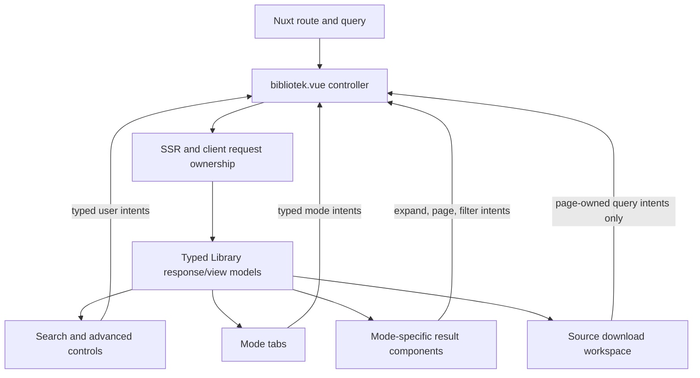

# Library Page Componentization Design

## Objective

Reduce `nuxt/app/pages/bibliotek.vue` from a 3,768-line page into a route-level controller plus focused Library components without changing visual output, URLs, SSR, hydration, browser history, API traffic, keyboard behavior, or download behavior.

The target is a page of roughly 1,800–2,100 lines. Extracted production components should normally remain below 600 lines and should each have one recognizable UI responsibility. The refactor must not introduce a page-only composable or move network ownership into child components.

## Chosen architecture

`bibliotek.vue` remains the composition root and owns the complete route and request lifecycle. Its children are typed renderers or self-contained UI widgets. The page prepares narrow view models and handles typed events; children must not read or mutate the route, create API clients, initiate Library searches, or own canonical query state.

This is a page-controller split:

Two alternatives are rejected:

- A single `LibraryResultsArea` would create another thousand-line component with the same mixed responsibilities as the current page.
- Moving route parsing, fetching, debounce/abort logic, or canonicalization into components or composables would distribute request ownership and conflict with the preference to keep page-only model code in `script setup`.

## Controller ownership

`bibliotek.vue` retains:

- parsing, validating, and serializing route/query state;
- canonical mode, filter, sort, page, advanced-filter, `hide1800`, standalone, and download-mode state;
- every `useAsyncData` call and all initial SSR data loading;
- API-client construction and primary, summary, inactive-count, and options requests;
- debounce timers, abort controllers, request versions, stale-response rejection, retry policy, and cleanup;
- canonical page reconciliation and `router.push`/`router.replace` decisions;
- route-preserving links, including sort, page, imprint-year, reset, and mode targets;
- advanced-draft composition where incomplete chronology text, partial options failures, and pending debounce state affect what may be committed;
- response assignment, derived result counts, page counts, and SEO/head state;
- the expanded work key because it is reflected in the `title` query and must follow browser history.

No child may call `useRoute`, `useRouter`, `useAsyncData`, `useFetch`, `$fetch`, `createLbApiClient`, or `useLbApiClient`.

## Shared component contracts

Typed presentation contracts live in `nuxt/app/lib/library/component-models.ts`. They contain discriminated view models and event payloads only; they contain no Vue refs, router objects, API clients, or mutable process-wide collections.

All navigation props use `RouteLocationRaw` or precomputed href strings so server-rendered links remain real links. Components emit semantic events such as `update-filter`, `reset`, `select-page`, `toggle-work`, and `commit-advanced`; they do not emit raw DOM events upward unless the controller genuinely needs the event.

Existing response/result types in `page-results.ts` and `view-model.ts` remain authoritative. The new module may compose those types but must not duplicate backend response shapes.

## Component boundaries

### `LibrarySearchControls.vue`

Owns the ordinary filter input, reset control, advanced disclosure trigger, and filter icon presentation currently surrounding the search input. It receives the displayed filter value, reset/advanced state, and precomputed reset target. It emits filter input, reset, and disclosure intents.

It does not own the debounce timer or route update. The DOM structure, form semantics, labels, data attributes, classes, and focus order remain byte-for-byte equivalent where Vue permits.

### `LibraryAdvancedFilters.vue`

Owns the advanced disclosure panel and its presentation controls: gender, keyword/category selections, about-author selection, narrowing collections, media, language, chronology range, download-mode switch, and visible-selection actions.

The page supplies a single typed advanced-controls model containing:

- current control values and option groups;
- option-availability flags;
- chronology bounds and draft endpoints;
- whether source selection actions are available;
- validation and disabled-state presentation.

The component emits typed, field-specific edits and commit intents. It owns only local widget mechanics such as opening/closing a multiselect. It must not decide which query keys are preserved, cleared, or canonicalized. The page remains responsible for composing live controls with routed values when options are unavailable or chronology input is invalid.

The existing `ChronologyRangeSlider` remains the sole pointer/range implementation.

### `LibraryModeTabs.vue`

Renders standalone EPUB/PDF tabs and normal All/Latest/Authors/Works/Parts/EPUB/PDF tabs from a discriminated tab model. Every tab receives its real SSR-safe target and active/count presentation. The component emits no routing event; `NuxtLink` performs navigation.

### `LibraryPagination.vue`

Replaces the four repeated paginator blocks. It receives previous, next, and numbered/ellipsis items with precomputed targets plus the existing data-attribute namespace. It renders real links for enabled targets and inert text for unavailable targets.

It must preserve:

- the legacy pagination item ordering and ellipses;
- `aria-current`, disabled semantics, and keyboard order;
- mode-specific data attributes used by browser tests;
- push-style history navigation through `NuxtLink`.

Pagination arithmetic, canonical bounds, and href creation stay in the page.

### Mode-specific result components

Result rendering is divided by materially different response shape rather than hidden behind a generic mega-component:

- `LibraryAllResults.vue` renders All sorting, mixed result kinds, highlights, author rows, imprint-year links, and `LibraryPagination`.
- `LibraryLatestResults.vue` renders the Latest sort/hide-1800 controls, date groups, rows, imprint-year links, and pagination.
- `LibraryAuthorResults.vue` renders author sorting, author rows, counts, and “show all” behavior.
- `LibraryBrowseResults.vue` renders ordinary Works and Parts sorting, expandable Works actions, tooltips, imprint-year links, and pagination. It receives the expanded key and emits `toggle-work`; the page owns its query synchronization.
- `LibraryDownloadResults.vue` renders the quick EPUB/PDF modes, their sorting, rows, download links, imprint-year links, and pagination.

Each mode component receives only its mode-specific response and presentation data. Loading, failed, and empty states remain in the same DOM position. The existing `v-library-tooltip` directive is imported by every child that renders tooltip-bearing nodes.

### `LibrarySourceDownloadWorkspace.vue`

Owns the academic source-download interaction as one cohesive local widget:

- download-mode Works rows and source-selection checkboxes;
- selected-work `Map` and selected-format `Set`;
- clear/select-visible/deselect-visible behavior local to the workspace;
- format button, teleported format popover, source grouping and size labels;
- popover refs, positioning, focus handoff/restoration, keyboard handling, resize handling, capture-scroll handling, and inner scrollport;
- native `/api/download` form fields and submission presentation.

The workspace receives refreshed Works rows and preserves selections for still-present work identities. It is unmounted when leaving source-download mode, matching the current selection reset boundary. It emits only controller-owned intents, such as an expanded-work query change if the download row shares that behavior.

The `<Teleport to="body">`, arrow geometry, viewport gap, scrollport, data attributes, and exact focus sequence are compatibility contracts. The outer popover must retain visible overflow so its arrow is not clipped.

## Styling and DOM compatibility

Scoped styles move with the nodes they style:

- advanced/multiselect/chronology rules move to `LibraryAdvancedFilters.vue`;
- tab rules move to `LibraryModeTabs.vue`;
- expandable-work rules move to `LibraryBrowseResults.vue` or the source workspace, according to ownership;
- popover rules move to `LibrarySourceDownloadWorkspace.vue`.

Legacy global classes are not renamed or normalized. Tailwind class order is retained unless the Tailwind linter requires its canonical equivalent and visual output is proven unchanged. Component roots must not introduce wrappers that alter grid, flex, absolute positioning, stacking, scoped-selector reach, or accessibility-tree order.

Existing data attributes are public test and behavior hooks and remain on the same semantic elements. Existing tooltip bindings, download attributes, form names, labels, roles, and `aria-*` state are preserved.

## SSR, hydration, and state guarantees

- The page performs exactly the same SSR requests with the same request bodies and identities.
- Children render entirely from props during SSR; none create request state during setup.
- Initial server markup and initial client render use the same props and disclosure state.
- Real links remain present in SSR markup for tabs, sorting, pagination, imprint years, titles, authors, and downloads.
- Route changes continue to use push or replace according to the current contract; extraction must not add watchers that create navigation loops.
- Selection state exists only inside the source-download workspace and does not leak between SSR requests or component instances.
- Module-level exported mutable arrays, Sets, Maps, or option objects are forbidden. Reusable catalogs remain private constants or return fresh per-instance structures.

## Migration sequence

The extraction proceeds in behavior-preserving stages, each committed and reviewed independently:

1. Add `component-models.ts`, extract `LibraryPagination.vue`, and replace all repeated paginator blocks.
2. Extract `LibraryModeTabs.vue` and the leaf All, Latest, Author, and quick-download result components.
3. Extract ordinary Works/Parts rendering into `LibraryBrowseResults.vue`, preserving expansion and tooltip behavior.
4. Extract `LibrarySourceDownloadWorkspace.vue` with its local selection and DOM-event lifecycle.
5. Extract `LibrarySearchControls.vue` and `LibraryAdvancedFilters.vue`, leaving advanced query composition in the page.
6. Remove dead page code/styles, audit ownership, and run the complete Library verification matrix.

If a stage requires changing product behavior to make extraction possible, that behavior change is split into a separate TDD fix and independently reviewed before the extraction continues.

## Verification and review gates

Every stage follows RED/GREEN/refactor discipline:

1. Add a focused component contract or browser characterization that fails when the proposed boundary is wired incorrectly.
2. Make the smallest extraction that preserves behavior.
3. Run scoped ESLint, typecheck, unit/SSR tests, and the relevant Library browser tests.
4. Commit only the stage’s files.
5. Have a fresh agent independently review the commit for specification fidelity and code quality; address Important findings in forward-only commits and request re-review.

The final gate includes:

- all Library unit and SSR suites, including sort hrefs and canonical paging;
- Library desktop and mobile behavior suites;
- advanced-filter and multiselect parity suites;
- source-download popover keyboard, focus, viewport, and scroll behavior;
- Library visual comparison suites on desktop and mobile, with any pre-existing baseline debt reported rather than silently updated;
- full Nuxt ESLint, typecheck, architecture policy, maintainability audit, and production build;
- a semantic-packet rescan of every new component and the reduced page;
- `git diff --check` and a scoped diff/status audit preserving unrelated semantic-review evidence.

## Completion criteria

The componentization is complete when:

- `bibliotek.vue` is approximately 1,800–2,100 lines and functions as a route/request controller rather than a monolithic renderer;
- no extracted component merely recreates the original monolith or normally exceeds 600 production lines;
- page-only route/fetch ownership remains in `bibliotek.vue`;
- repeated pagination markup has one implementation;
- source-download DOM behavior has one local owner;
- all existing URLs, request bodies, SSR links, history semantics, focus behavior, data attributes, and visual geometry remain unchanged;
- all required verification gates are green, except explicitly evidenced pre-existing visual debt permitted by the existing project verification policy;
- independent review reports no unresolved Critical or Important findings.
